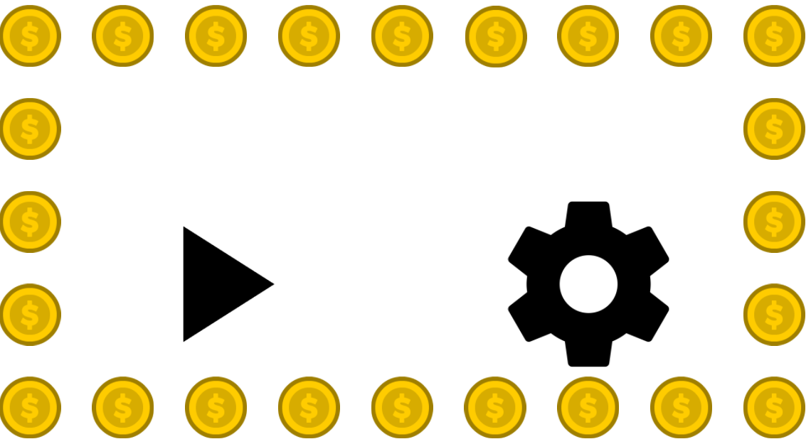

## Quem sou eu?
  
  
Sou Beatriz Rodrigues Estevam, estudante do curso técnico integrado de Programação de Jogos Digitais(2015.1)-IFRN, campus Ceará-Mirim.
    
    
  

#### Contatos:  
  
  
*  E-mail: bia.rodrigues4567@gmail.com
*  Instagram: beatrizre_
  
  
## Portfólio  
  
  
### Games   
  
  
[Jogo 1 oficina de criação : 
](https://wesleylandia.github.io/$/)

[Jogo 2 oficina de criação :  
](https://jordanag.github.io/FonoKids2/)

[Jogo 3 oficina de criação :  
](https://cavalcantebya.github.io/quepaiseesse/)

  
  
### Artes
  
 >   
 >  
 >     
 >  
 >     
 >           
 >        
 >     
 >   
   
 
 

## Participação em eventos:

> SECITEX(2015), IFRN campus Santa Cruz, com o projeto Camp Song, na modalidade apresentação cultural.  
>  
> SECITEX(2016), IFRN campus Parnamirim, dando início para a abertura do evento com a presentação do Camp Song.  
>
> Epo games(2016), UFRN-IMD, presenciando durante todo o dia.
>
> III Encontro de Informática do Agreste Potiguar(2018), IFRN Nova Cruz, exposição do protótipo do jogo Fono Kids.  

  
 >   
 >  
 >   
 >  
 > 
      
   
   ## Galeria
    
 https://www.youtube.com/watch?v=ew5a4t53OMw  
 
  > 
   
