## Quem sou eu?
  
  
Sou Beatriz Rodrigues Estevam, estudante do curso técnico integrado de Programação de Jogos Digitais(2015.1)-IFRN, campus Ceará-Mirim.
    
    
  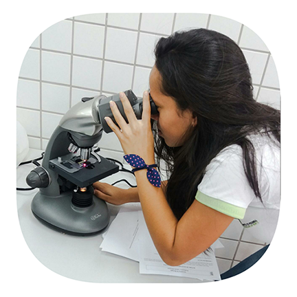

#### Contatos:  
  
  
*  E-mail: bia.rodrigues4567@gmail.com
*  Instagram: beatrizre_
  
  
## Portfólio  
  
  
### Games   
  
  
[Jogo 1 oficina de criação :   
](https://wesleylandia.github.io/$/)  
*  Jogo referente a matéria de oficina com o professor Marcelo Barros, no primeiro bimestre(2017.1). Você tem o objetivo de coletar moedas de locais diferentes para poder viajar. Vá lá, siga sempre em frente!!  

[Jogo 2 oficina de criação :  
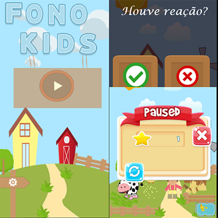](https://jordanag.github.io/FonoKids2/)  
*  O protótipo do jogo Fono kids, requisito ao segundo bimestre(2017.1), tem como objetivo  cooperar para o processo terapêutico da reabilitação auditiva da criança de uma forma mais dinâmica, tanto para o paciente, como para o especialista que estará fazendo com que o seu trabalho seja mais divertido para a criança.  

[Jogo 3 oficina de criação :  
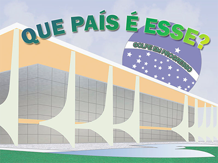](https://cavalcantebya.github.io/quepaiseesse/)  
*  Este jogo faz uma crítica a política brasileira. Jogo relacionado ao terceiro bimestre(2017.1).

  
  
### Artes
  
 > 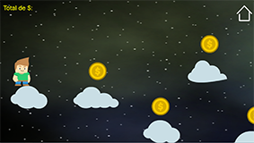  
 >  
 > 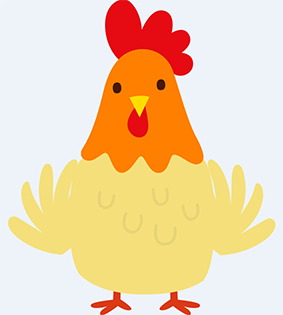    
 >  
 > 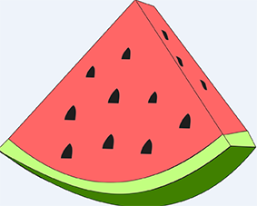    
 >           
 >        
 >     
 > 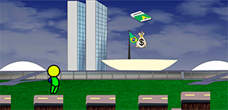  
   
 
 

## Participação em eventos:

> SECITEX(2015), IFRN campus Santa Cruz, com o projeto Camp Song, na modalidade apresentação cultural.  
>  
> SECITEX(2016), IFRN campus Parnamirim, dando início para a abertura do evento com a presentação do Camp Song.  
>
> Epo games(2016), UFRN-IMD, presenciando durante todo o dia.
>
> III Encontro de Informática do Agreste Potiguar(2018), IFRN Nova Cruz, exposição do protótipo do jogo Fono Kids.  

  
 > 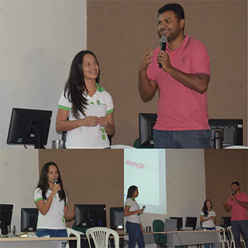  
 >  
 > 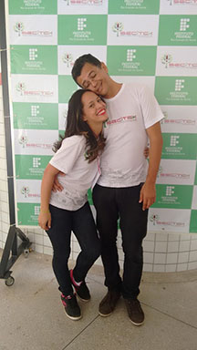  
 >  
 > 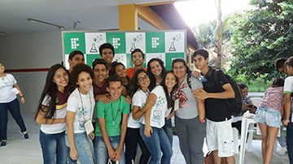
      
   
   ## Galeria 
  
  *  Minha playlist para você  
    
  > [Wesley Safadão - Tem cara, tem cheiro, tem nome](https://www.youtube.com/watch?v=rDfXIzLDEsk)
  > [Ed Sheeran - Photograph (Felix Jaehn Remix)](https://www.youtube.com/watch?v=e0MP9Bmzp0g)     
  > [Bon Jovi - You Give Love A Bad Name](https://www.youtube.com/watch?v=KrZHPOeOxQQ)  
  > [Preto no Branco - Ninguém Explica Deus ft. Gabriela Rocha](https://www.youtube.com/watch?v=LYsaKn8FRhc)
  > [Márcia Fellipe - Quatro Sorrisos](https://www.youtube.com/watch?v=jrfRsdzi6dk)  
  > [Maluma - Felices los 4](https://www.youtube.com/watch?v=hM5lO2PWnGk)  
  > [Wesley Safadão - Onde Está Você (Meu Amanhecer)](https://www.youtube.com/watch?v=j_kAgVCgjcU)
  > [Hélio Borges - O Que Tua Glória Fez Comigo](https://www.youtube.com/watch?v=jaAcyvgJvjw)    
  > [Wesley Safadão - Jeito Safado Part. Márcia Fellipe](https://www.youtube.com/watch?v=KNIOYEmxtcg)  
  > [Felipe Peláez - Vivo Pensando En Ti ft. Maluma](https://www.youtube.com/watch?v=cPW9Y94BJI0)  
      
  *  Áudio relacionado ao trabalho do quarto bimestre de sociologia, 2ºano.  
  > [Rádio cultura e vida.](https://www.youtube.com/watch?v=ew5a4t53OMw)  
    
  *  Fotos  
   
  > 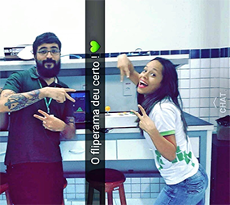  
    O fliperama foi uma atividade avaliativa da matéria de interface, com o professor Marcelo Barros, referente ao 1° ano letivo(2015).
  >     
  > 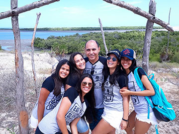  
     Aula de campo em Ponta do Tubarão(2017), junto aos professores Paulo, Miguel e Videanny.  
  >      
  > 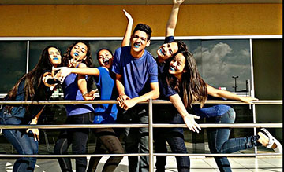  
     Apresentação de dança(2016), referente a matéria de Educação física-professora Bete.
  >     
  > 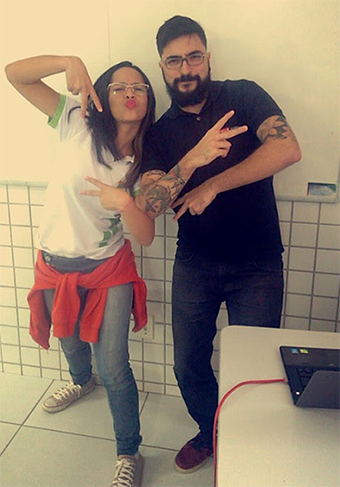  
    O melhor professor de interface que os alunos de jogos poderiam ter tido. "Marcelo Mesmo/Paçoca".
  >                
  > 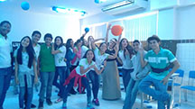  
    Planetário, trabalho referente a matéria de geografia-Evaneide Melo. (2015)
   
